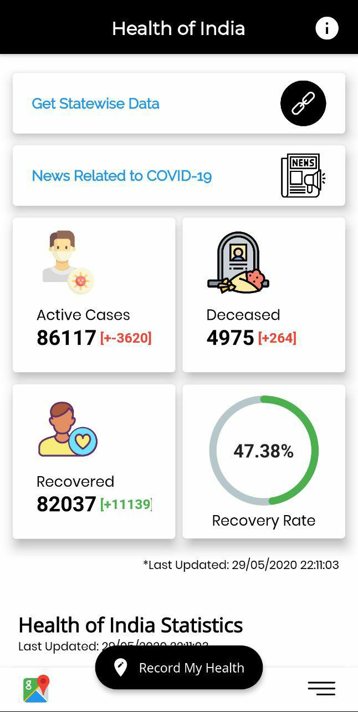
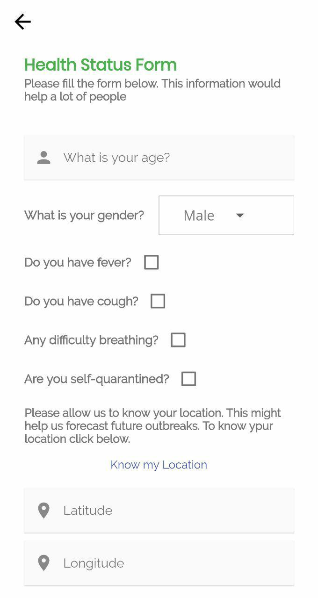
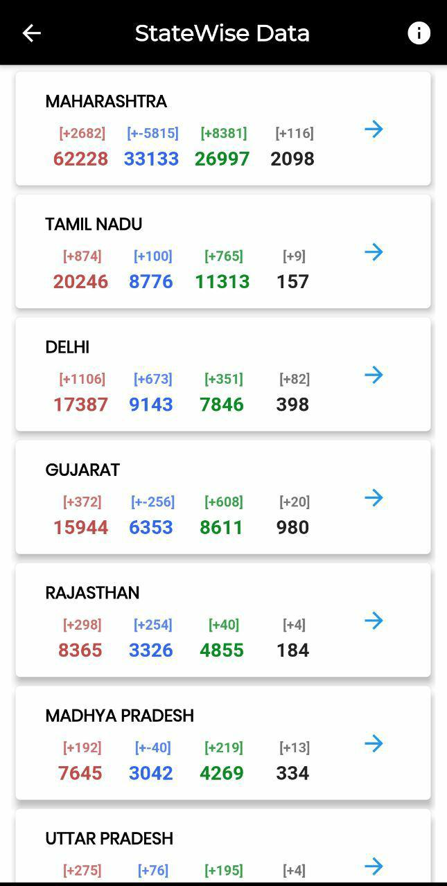

# Fight-Covid19-App
A mobile application to map symptomatic patients of covid19 on map and collect continuous health updates from individuals.
(*the app wont be working now as the server is down for maintenance)
# Features
* Displays the total number of cases, deaths, recoveries and other detailed information regarding Covid19
* Displays state wise and district wise data
* Shows news related to Covid19
* Maps symptomatic patients of covid19 on map
* Collects continuous health updates from individuals

# Flutter App Screenshots
### Dashboard

### Form

### StateWise data

 
